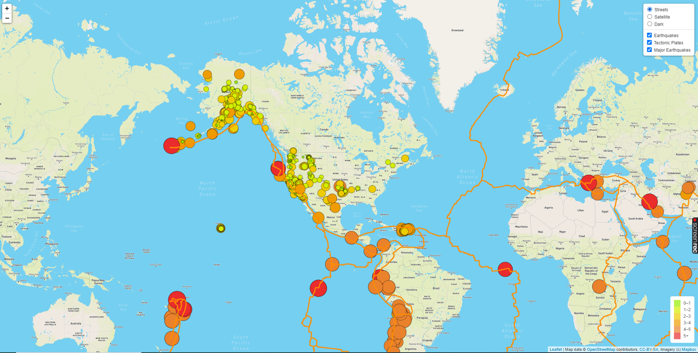
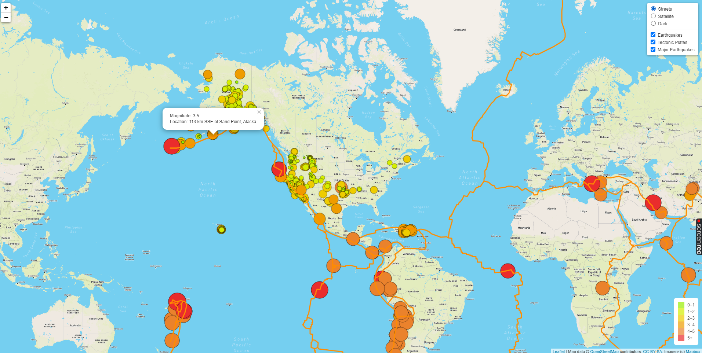
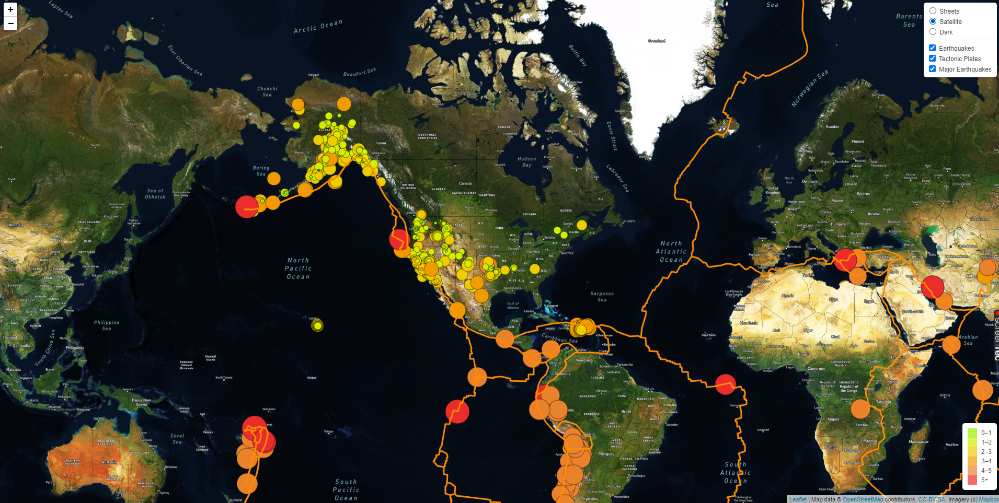
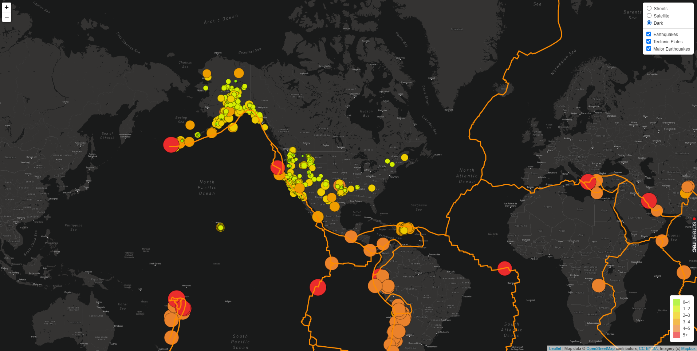

# Mapping_Earthquakes
Module 13 Challenge repository for mapping earthquakes and tectonic plates using JavaScript, Leaflet.js, and geoJSON data.

The images below illustrate the following activities performed:
1.  Addition of tectonic plate data as another layer that can be toggled on or off (toggled on as default).
2.  Addition of popup markers for each earthquake that displays the magnitude and location of the earthquake.
3.  Addition of a third map style that displays a dark map

Website viewable at:   https://fchoi0505.github.io/Mapping_Earthquakes/

### Steets Map image

### Steets Map with Popup Marker image

### Satellite Map image

### Dark Map image

